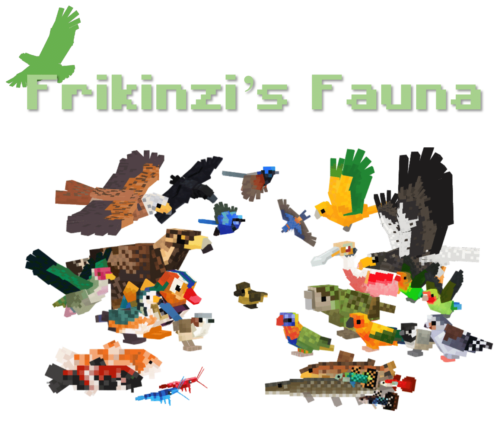

# creatures_plus
 A Minecraft mod aiming to add various birds and fish to your world.
 

The Creatures mod (for 1.12.2) adds a variety of animals to Minecraft that are not usually found in other animal mods. In its current stage, the mod is functional for creative mode. 

Natural spawning and survival functionality may come later. Many of the birds are currently tameable. 

**This mod will require GeckoLib for 1.12.2! Find that here: https://www.curseforge.com/minecraft/mc-mods/geckolib/files/3424174**

The mod currently has 21 animals. Not all are guaranteed to stay for public release:
**aquatic creatures**
- Koi (6 variants)
- Dottyback (3 species)
- Pike
- Cherry Shrimp (8 variants)
- Guppy (6 variants)
- Gourami (5 variants)
- Arowana (3 variants)
- Ghost Crab (4 variants)

**birds**
- Lovebird (6 species) (tameable)
- Lorikeet (3 species) (tameable)
- Conure (3 species) (tameable)
- Spoonbill (3 species)
- Dove/Pigeon (5 species) (tameable)
- Mandarin Duck
- Kakapo (tameable)
- Raven (tameable)
- Fairywren (5 species) (tameable)
- Golden Eagle (tameable)
- Gyrfalcon (tameable)
- Red Kite (tameable)
- Steller's Sea Eagle (tameable)

Creatures' Curseforge Page: https://www.curseforge.com/minecraft/mc-mods/creatures
